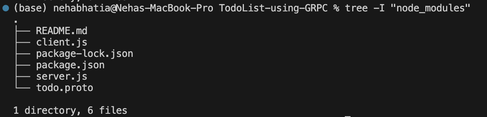
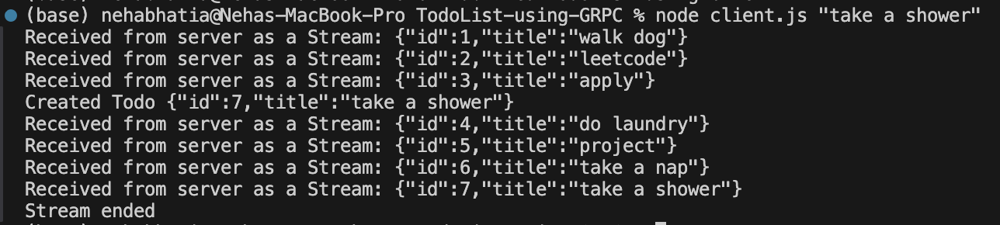

# gRPC To-Do Application

This is a simple gRPC-based To-Do application built using Node.js. The project includes a server and client, where the client interacts with the server to create to-do items and fetch them via gRPC calls.

### **What is gRPC?**

gRPC (gRPC Remote Procedure Call) is a framework developed by Google for high-performance, language-agnostic communication. It uses Protocol Buffers (protobuf) for efficient serialization.

### Key Features of gRPC

**Cross-Language Support:** Works across multiple programming languages.

**Streaming:** Supports bidirectional streaming.

**Scalable:** Ideal for microservices architecture.

### Pros & Cons of gRPC
**Pros:** High performance, type safety, scalability.

**Cons:** Learning curve, debugging binary data, limited browser support.

---
## Features
**Create To-Do:**  Add new to-do items to the server.

**fetch All To-Dos:** Retrieve all to-do items from the server in one go.

**Stream To-Dos:** Fetch to-do items as a stream from the server.

This project is based on Hussein Nasser's gRPC crash course - https://www.youtube.com/watch?v=Yw4rkaTc0f8&t=1348s&ab_channel=HusseinNasser

---
## Project Structure


### todo.proto
Defines the gRPC service and messages:

#### Service:
---
**createTodo(TodoItem):** Creates a new to-do item.

**readTodos(voidnoparam):** Fetches all to-do items at once.

**readTodoStream(voidnoparam):** Streams all to-do items.

#### Messages:
---
**TodoItem:** Represents a to-do item with id and title.

**voidnoparam:** Represents a void message.

**TodoItems:** A collection of TodoItem.

---
## Setup and Usage

**Prerequisites**

* Install Node.js.
* Install gRPC and Protocol Buffers libraries:

    ```npm install @grpc/grpc-js @grpc/proto-loader```

**Steps:**

* Clone the repository:
    ``` git clone https://github.com/Neha-Bhatia551/TodoList-using-GRPC.git ```

    ```cd TodoList-using-GRPC/```
* Install dependencies:
    ```npm install```
* Run the server
    ```node server.js```
* Run the client, and pass the todo as an command line argument
    ```node client.js "Do Laundry"```


---
## Example workflow



